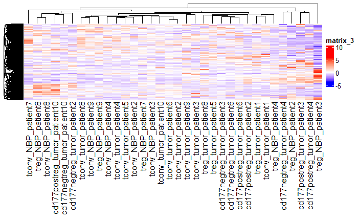

# 1. Introduction
***
## 1.1 Package Setup
***
Make sure following packages are installed before compiling the RNotebook file.

```{r setup, message=FALSE, warning=FALSE}

if (!requireNamespace("BiocManager", quietly = TRUE)) {
  install.packages("BiocManager")
}
library(BiocManager)

if (!requireNamespace("GEOmetadb", quietly = TRUE)) {
  BiocManager::install("GEOmetadb")
}
library(GEOmetadb)

if (!requireNamespace("biomaRt", quietly = TRUE)) {
  BiocManager::install("biomaRt")
}
library(biomaRt)

if (!requireNamespace("edgeR", quietly = TRUE)) {
  install.packages("edgeR")
}
library(edgeR)

if (!requireNamespace("DBI", quietly = TRUE)) {
  install.packages("DBI")
}
library(DBI)

if (!requireNamespace("limma", quietly = TRUE)) {
  install.packages("limma")
}
library(limma)

if(!requireNamespace("knitr", quietly=TRUE)) {
  install.packages("knitr")
}
library(knitr)

if(!requireNamespace("kableExtra", quietly=TRUE)) {
  install.packages("kableExtra")
}
library(kableExtra)

if (!requireNamespace("ComplexHeatmap", quietly = TRUE)) {
  install.packages("ComplexHeatmap")
}
library(ComplexHeatmap)

if (!requireNamespace("circlize", quietly = TRUE)) {
  install.packages("circlize")
}
library(circlize)

if (!requireNamespace("gprofiler2", quietly = TRUE)) {
  install.packages("gprofiler2")
}
library(gprofiler2)
```

## 1.2 Previous Data Overview
***
Data set **GSE89225** was selected, cleaned and normalized in assignment 1. The data set contains RNAseq data from normal breast parenchyma (NBP) and tumor tissues [@plitas2016regulatory]. Following is the basic procedure of data manipulation we did.

### Download the Data Set
```{r download data, message=FALSE, warning=FALSE}
# Get expression data
geo_id <- "GSE89225"

# Get expression data from GEOquery
sfiles <- GEOquery::getGEOSuppFiles(geo_id)
fnames <- rownames(sfiles)

# Read CSV and change column names
tcell_exp <- read.csv(fnames[1], header = TRUE, check.names = FALSE)
colnames(tcell_exp)[1] <- "ensembl_gene_id"
```

### Define the Groups
```{r group, message=FALSE, warning=FALSE}
# Separate by "_" and define groups
samples <- data.frame(lapply(colnames(tcell_exp)[2:35], 
                             FUN=function(x){unlist(strsplit(x, split = "_"))}))
colnames(samples) <- colnames(tcell_exp)[2:35]
rownames(samples) <- c("Tcell_type","tissue_type", "patients")
samples <- data.frame(t(samples))

# Output group table
samples[1:10, ] %>%
  kableExtra::kbl(caption = "Table 1. Groups of Samples") %>%
  kableExtra::kable_classic(full_width = F, html_font = "Cambria")
```

### Clean the Data Set
```{r clean, message=FALSE, warning=FALSE}
# Check for duplicated genes
summarized_gene_counts <- sort(table(tcell_exp$ensembl_gene_id), decreasing = TRUE)

# Remove invalid Ensenbl gene ids
valid_tcell_exp <- tcell_exp[grep("ENSG", tcell_exp$ensembl_gene_id), ]

# Translate out counts into counts per million
cpms <- edgeR::cpm(valid_tcell_exp[, 2:35])
rownames(cpms) <- valid_tcell_exp[, 1]

# Get rid of low counts
keep <- rowSums(cpms > 1) >= 10
filtered_tcell_exp <- valid_tcell_exp[keep, ]
```

### Map to HUGO Symbols
```{r id_conversion, message=FALSE, warning=FALSE}
# Connect to the desired mart
ensembl <- biomaRt::useMart("ensembl")

# Get the set of datasets availble
datasets <- biomaRt::listDatasets(ensembl)

# Limit to the human datasets availble
ensembl <- biomaRt::useDataset("hsapiens_gene_ensembl", mart=ensembl)

# Naming id conversion stash
conversion_stash <- "tcell_id_conversion.rds"

# Save the conversion
if (file.exists(conversion_stash)) {
  tcell_id_conversion <- readRDS(conversion_stash)
} else {
  tcell_id_conversion <- biomaRt::getBM(attributes = c("ensembl_gene_id","hgnc_symbol"), 
                                      filters = c("ensembl_gene_id"), 
                                      values = filtered_tcell_exp$ensembl_gene_id,
                                      mart = ensembl)
  saveRDS(tcell_id_conversion, conversion_stash)
}

# Annotated version (merge)
annot_tcell_exp <- merge(tcell_id_conversion, filtered_tcell_exp, all.y = TRUE)
```

### Normalization (TMM)
```{r save original, message=FALSE, warning=FALSE}
# Reassignment
original_tcell_exp <- annot_tcell_exp

# Output original data set table
original_tcell_exp[1:5,1:5] %>%
  kableExtra::kbl(caption = "Table 2. Original Data Set") %>%
  kableExtra::kable_classic(full_width = F, html_font = "Cambria")
```

```{r tmm, message=FALSE, warning=FALSE}
# Create an edgeR container for RNASeq count data
original_data_matrix <- as.matrix(original_tcell_exp[, 3:36])
rownames(original_data_matrix) <- original_tcell_exp$ensembl_gene_id

# Calculate the normalization factors
d <- edgeR::DGEList(counts = original_data_matrix, group = samples$tissue_type)
d <- edgeR::calcNormFactors(d)

# Normalize data set
normalized_tcell_exp <- edgeR::cpm(d)
normalized_tcell_exp <- cbind(original_tcell_exp[, 1:2], normalized_tcell_exp)
rownames(normalized_tcell_exp) <- NULL

# Remove duplicate HGNC symbols to avoid false assignment in the future
normalized_tcell_exp <- dplyr::distinct(normalized_tcell_exp, hgnc_symbol, .keep_all = TRUE)

# Output normalized data set table
normalized_tcell_exp[1:5,1:5] %>%
  kableExtra::kbl(caption = "Table 3. Normalized Data Set") %>%
  kableExtra::kable_classic(full_width = F, html_font = "Cambria")
```


# 2. Differential Gene Expression
***

## 2.1 Heatmap
***

```{r initial heatmap, message=FALSE, warning=FALSE}
# Create a numerical heatmap matrix
heatmap_matrix <- normalized_tcell_exp[, 3:ncol(normalized_tcell_exp)]
rownames(heatmap_matrix) <- normalized_tcell_exp$ensembl_gene_id
colnames(heatmap_matrix) <- colnames(normalized_tcell_exp[, 3:ncol(normalized_tcell_exp)])

# Scale
heatmap_matrix <- t(scale(t(heatmap_matrix)))

# Decide the colour by range
heatmap_col = circlize::colorRamp2(c(min(heatmap_matrix), 0, 
                                     max(heatmap_matrix)), c("blue", "white", "red"))  

# Create the heatmap
current_heatmap <- ComplexHeatmap::Heatmap(as.matrix(heatmap_matrix), 
                                           show_row_dend = TRUE,
                                           show_column_dend = TRUE,  
                                           col=heatmap_col,
                                           show_column_names = TRUE,
                                           show_row_names = FALSE,
                                           show_heatmap_legend = TRUE)

# Heatmap is too big for re-creating it every single time, so it is pre-created on local machine and saved in the folder
```



The initial heatmap does not exhibit clear gene expression variations. Therefore, differential gene expression analysis is necessary.

## 2.2 MDS Plots
***

```{r mds tissue, message=FALSE, warning=FALSE}
# Plot MDS by tissue type
limma::plotMDS(normalized_tcell_exp[, 3:36], 
               labels = samples$tissue_type, 
               col = c("darkgreen", "red")[factor(samples$tissue_type)],
               main = "Figure 5. MDS Plot by Tissue Type")
```

```{r mds patient, message=FALSE, warning=FALSE}
# Plot MDS by patient
limma::plotMDS(normalized_tcell_exp[, 3:36], 
               labels = samples$patient, 
               col = unlist(rainbow(10))[factor(samples$patient)],
               main = "Figure 6. MDS Plot by Patient")
```

Multidimensional scaling (MDS) plots help us to examine the variation between tissue type and patients. The clustering of samples from the same patient is tighter than the clustering of samples from different patients. Consequently, it is important to consider the potential impact of patient variability on the presence of false-positive results. 

## 2.3 Limma
***
From here, we will use the `limma` package to examine the different between simple (tissue-only) model and patient (tissue+patient) model.

### Simple Model (Tissue Type Only)
```{r limma tissue, message=FALSE, warning=FALSE}
# Create design matrix (tissue type only)
model_design <- model.matrix(~ samples$tissue_type)

# Create data matrix
expressionMatrix <- as.matrix(normalized_tcell_exp[, 3:36])

rownames(expressionMatrix) <- normalized_tcell_exp$ensembl_gene_id
colnames(expressionMatrix) <- colnames(normalized_tcell_exp)[3:36]

minimalSet <-  Biobase::ExpressionSet(assayData = expressionMatrix)

# Fit data to model
fit <- limma::lmFit(minimalSet, model_design)

# The parameter trend = T is specfic to RNA-seq data
fit2 <- limma::eBayes(fit, trend = TRUE)

# Create topfit table
topfit <- limma::topTable(fit2,                    
                   coef = ncol(model_design),                   
                   adjust.method = "BH",                   
                   number = nrow(expressionMatrix))

# Merge hgnc names to topfit table
output_hits <- merge(normalized_tcell_exp[, 1:2],
                     topfit,
                     by.y = 0, by.x = 1,
                     all.y = TRUE)

output_hits_copy <- output_hits

# Sort by p-value
output_hits <- output_hits[order(output_hits$P.Value),]

# Output data fitted with tissue Type by limma (ordered by p-value)
output_hits[1:10, 2:8] %>%
  kableExtra::kbl(caption = "Table 7. Fitted with Tissue Type by Limma (ordered by p-value)", 
                  row.names = FALSE) %>%
  kableExtra::kable_classic(full_width = F, html_font = "Cambria")

# How many genes pass the threshold p-value < 0.05?
length(which(output_hits$P.Value < 0.05))

# How many genes pass correction?
length(which(output_hits$adj.P.Val < 0.05))
```

### Patient Model (Tissue Type + Patient)
```{r limma tissue + patient, message=FALSE, warning=FALSE}
# Create design matrix (tissue type + patient)
model_design_pat <- model.matrix(~ samples$patients + samples$tissue_type)

# Fit data to model
fit_pat <- limma::lmFit(minimalSet, model_design_pat)

# The parameter trend = T is specfic to RNA-seq data
fit2_pat <- limma::eBayes(fit_pat, trend = TRUE)

# Create topfit table
topfit_pat <- limma::topTable(fit2_pat,
                              coef = ncol(model_design_pat),
                              adjust.method = "BH",
                              number = nrow(expressionMatrix))

# Merge hgnc names to topfit table
output_hits_pat <- merge(normalized_tcell_exp[, 1:2],
                         topfit_pat,
                         by.y = 0, by.x = 1,
                         all.y = TRUE)

# Sort by p-value
output_hits_pat <- output_hits_pat[order(output_hits_pat$P.Value),]

# Output data fitted with tissue type by limma (ordered by p-value)
output_hits_pat[1:10, 2:8] %>%
  kableExtra::kbl(caption = "Table 8. Data Fitted with Tissue Type and Patient by Limma (ordered by p-value)", 
                  row.names = FALSE) %>%
  kableExtra::kable_classic(full_width = F, html_font = "Cambria")

# How many genes pass the threshold p-value < 0.05?
length(which(output_hits_pat$P.Value < 0.05))

# How many genes pass correction?
length(which(output_hits_pat$adj.P.Val < 0.05))
```

### Simple vs Patient
```{r compare model, message=FALSE, warning=FALSE}
# Compare the results from the two different models
simple_model_pvalues <- data.frame(hgnc_symbol = output_hits$hgnc_symbol,
                                   simple_pvalue = output_hits$P.Value)

pat_model_pvalues <-  data.frame(hgnc_symbol = output_hits_pat$hgnc_symbol,
                                 patient_pvalue = output_hits_pat$P.Value)

# Merge two model
two_models_pvalues <- merge(simple_model_pvalues, pat_model_pvalues, by.x=1, by.y=1)

# Models' dot colours
two_models_pvalues$colour <- "black"
two_models_pvalues$colour[two_models_pvalues$simple_pvalue < 0.05] <- "orange"
two_models_pvalues$colour[two_models_pvalues$patient_pvalue < 0.05] <- "blue"
two_models_pvalues$colour[two_models_pvalues$simple_pvalue < 0.05 & 
                            two_models_pvalues$patient_pvalue<0.05] <- "red"

# Output comparison plot
plot(two_models_pvalues$simple_pvalue, 
     two_models_pvalues$patient_pvalue,     
     col = two_models_pvalues$colour,     
     xlab = "Simple model p-values",     
     ylab ="Patient model p-values",      
     main = "Figure 9. Simple vs Patient Limma")

# Plot legend
legend("topright", 
       legend=c("Simple", "Patient", "Both", "Not signif"), 
       fill = c("orange", "blue", "red", "black"))
```

### Simple vs Patient (CCR)
```{r ccr, message=FALSE, warning=FALSE}
# Set base colour
two_models_pvalues$colour <- "grey"

# Plot
plot(two_models_pvalues$simple_pvalue,     
     two_models_pvalues$patient_pvalue,     
     col = two_models_pvalues$colour,     
     xlab = "Simple model p-values",     
     ylab ="Patient model p-values",      
     main = "Figure 10. Simple vs Patient Limma")

# Highlight CCR genes
points(two_models_pvalues[which(grepl("CCR", two_models_pvalues$hgnc_symbol)), 2:3],
       pch = 20, col = "red", cex = 1.5)

# Add Legend
legend("bottomright", legend=c("CCR", "rest"), fill = c("red", "grey"))
```

The comparison plot generated by both the complex and simple limma models indicates a discrepancy between the two models, consistent with the MDS plots presented earlier. Figure #. Simple vs Patient Limma highlights the CCR genes referenced in the research, which are more tightly clustered in the simple model compared to the complex model. Therefore, I have opted to utilize the simple (tissue-only) model by `limma`.


## 2.4 edgeR (Quasi Liklihood Model)
***

Package `edgR` provides quasi likelihood model for analyzing the simple (tissue-only) scenario.

```{r qlf, message=FALSE, warning=FALSE}
# Create design matrix
edgeR_model_design <- model.matrix(~ samples$tissue_type)

# Set edgeR object
edgeR_d <- edgeR::DGEList(counts = expressionMatrix, 
                    group=samples$tissue_type)

# Estimate dispersion
edgeR_d <- edgeR::estimateDisp(edgeR_d, edgeR_model_design)

# Fit the Quasi liklihood model
edgeR_fit <- edgeR::glmQLFit(edgeR_d, edgeR_model_design)
edgeR_qlf <- edgeR::glmQLFTest(edgeR_fit, coef = 'samples$tissue_typetumor')

# Output fit table
edgeR::topTags(edgeR_qlf) %>%
  kableExtra::kbl(caption = "Table 11. Data Fitted with Tissue Type by edgeR", row.names = FALSE) %>%
  kableExtra::kable_classic(full_width = F, html_font = "Cambria")

# Sort by p-values
qlf_output_hits <- edgeR::topTags(edgeR_qlf,
                                  sort.by = "PValue",
                                  n = nrow(normalized_tcell_exp))

# How many gene pass the threshold p-value < 0.05?
length(which(qlf_output_hits$table$PValue < 0.05))

# How many genes pass correction?
length(which(qlf_output_hits$table$FDR < 0.05))
```

## 2.5 Limma vs Quasi Liklihood
***

Compare the results from the two different methods.

```{r limma vs edgeR, message=FALSE, warning=FALSE}
# Manipulate QLF set to contain HGNC symbols as well
qlf_df <- data.frame(ensembl_gene_id = rownames(qlf_output_hits$table),  
                                 qlf_pvalue = qlf_output_hits$table$PValue)
qlf_df <- merge(tcell_id_conversion, qlf_df, by = "ensembl_gene_id", all.x = TRUE)

# Get only HGNC symbol and p-values
qlf_model_pvalues <- qlf_df[, 2:3]

limma_model_pvalues <- data.frame(hgnc_symbol = output_hits$hgnc_symbol,
                                  limma_pvalue = output_hits$P.Value)

# Merge two models' p-values
two_models_pvalues <- merge(qlf_model_pvalues, limma_model_pvalues, by.x=1, by.y=1)

# Decide the colours of dots
two_models_pvalues$colour <- "black"
two_models_pvalues$colour[two_models_pvalues$qlf_pvalue < 0.05] <- "orange"
two_models_pvalues$colour[two_models_pvalues$limma_pvalue < 0.05] <- "blue"
two_models_pvalues$colour[two_models_pvalues$qlf_pvalue < 0.05 &
                            two_models_pvalues$qlf_pvalue < 0.05] <- "red"

# Plot the comparison
plot(two_models_pvalues$qlf_pvalue,     
     two_models_pvalues$limma_pvalue,     
     col = two_models_pvalues$colour,     
     xlab = "QLF simple model p-values",     
     ylab ="Limma simple model p-values",      
     main="Figure 12. QLF vs Limma by Tissue Type")
legend("topleft", legend=c("QLF", "Limma", "Both", "Not signif"), 
       fill = c("orange", "blue", "red", "black"))
```

```{r ccr vs, message=FALSE, warning=FALSE}
# Set base colour
two_models_pvalues$colour <- "grey"

# Plot
plot(two_models_pvalues$qlf_pvalue,
     two_models_pvalues$limma_pvalue,     
     col = two_models_pvalues$colour,     
     xlab = "QLF model p-values",     
     ylab = "Limma model p-values",      
     main = "Figure 13. QLF vs Limma by Tissue Type (CCR)")

# Highlight CCR points
points(two_models_pvalues[which(grepl("CCR",two_models_pvalues$hgnc_symbol)), 2:3],
       pch = 20, col = "red", cex = 1.5)

# Add legend
legend("bottomright", legend = c("CCR", "rest"), fill = c("red", "grey"))
```

The QLF model in `edgeR` package identifies a greater number of CCR genes as significant compared to the `limma` model. Therefore, I prefer to use the QLF model by `edgeR`.


## 2.6 MA Plot
***

```{r ma plot, message=FALSE, warning=FALSE}
# Clustering samples by sample type
tumor <- normalized_tcell_exp[, grepl("tumor", colnames(normalized_tcell_exp))]
NBP <- normalized_tcell_exp[, grepl("NBP", colnames(normalized_tcell_exp))]
exp_avg <- data.frame(hgnc_symbol = gsub("-", ".", normalized_tcell_exp[, 2]), 
                      Tumor = rowMeans(tumor), 
                      NBP = rowMeans(NBP))

# Construct the edgeR result table
qlf_result <- cbind(qlf_output_hits$table, ensembl_gene_id = rownames(qlf_output_hits$table))
qlf_result <- merge(tcell_id_conversion, qlf_result, by = "ensembl_gene_id", all.x = TRUE)

# Merge it with the fit result
merged_result <- merge(exp_avg, qlf_result, by.x = "hgnc_symbol", by.y = "hgnc_symbol", all = TRUE)

# Prepare coloring on the plots
status <- rep(0, nrow(merged_result))
status[merged_result$logFC < 0 & merged_result$PValue < 0.05] <- -1
status[merged_result$logFC > 0 & merged_result$PValue < 0.05] <- 1

# MA plots (points labelled with edgeR)
limma::plotMD(log2(merged_result[, c(2,3)]), 
              status = status, 
              values = c(-1, 1), 
              hl.col=c("blue", "red"), 
              main = "Figure 14. MA Plot")
```

The amount of differentially expressed genes was shown by *Figure 14. MA Plot*. Up-regulated genes are highlighted in red, and down-regulated genes are highlighted in blue.


## 2.7 Annotated Heatmap
***
```{r annot_heatmap, message=FALSE, warning=FALSE}
# Rename heatmap matrix's rownames to HGNC symbols
rownames(heatmap_matrix) <- normalized_tcell_exp$hgnc_symbol

# Subset the threshold gene
top_hits <- qlf_result$hgnc_symbol[qlf_result$PValue < 0.05]

# Create top hit version of heatmap matrix
heatmap_matrix_tophits <- heatmap_matrix[which(rownames(heatmap_matrix) %in% top_hits),]
heatmap_matrix_tophits <- heatmap_matrix_tophits[, c(grep("tumor", colnames(heatmap_matrix_tophits)),
                            grep("NBP", colnames(heatmap_matrix_tophits)))]

# Decide the colour by range
heatmap_col = circlize::colorRamp2(c(min(heatmap_matrix_tophits), 
                                     0,
                                     max(heatmap_matrix_tophits)),
                                   c("blue", "white", "red"))

# Set colours
ha_colours <- c("red", "darkgreen")
names(ha_colours) <- c("tumor", "NBP")

# Set annotations
ha <- ComplexHeatmap::HeatmapAnnotation(df=data.frame(
  type = rep(c("tumor", "NBP"), c(22, 12))),
  col = list(type = ha_colours))

# Plot annotated heatmap
annotated_heatmap <- ComplexHeatmap::Heatmap(as.matrix(heatmap_matrix_tophits),
                           cluster_rows = TRUE,
                           cluster_columns = FALSE,
                           show_row_dend = TRUE,
                           show_column_dend = FALSE,
                           col = heatmap_col,
                           show_column_names = TRUE,
                           show_row_names = FALSE,
                           show_heatmap_legend = TRUE,
                           top_annotation = ha,
                           column_title = "Figure 15. Annotated Heatmap")


# Output annotated heatmap
annotated_heatmap
```

The annotated heatmap provides better clustering compared to *Figure 4. Initial Heatmap*. Firstly, some red clusters were observed in the top left region of the data under tumor conditions. Secondly, some red clusters were observed in the bottom right region of the data under the NBP condition. These observations suggest that there is a clear distinction between the NBP and tumor conditions based on the presence and location of the red clusters.


# 3. Thresholded Over-representation Analysis
***

## 3.1 Threshold List
***
```{r threshold list, message=FALSE, warning=FALSE}

# How many genes are up regulated?
length(which(qlf_result$PValue < 0.05 & qlf_result$logFC > 0))


# How many genes are down regulated?
length(which(qlf_result$PValue < 0.05 & qlf_result$logFC < 0))

# Add rank column and order
qlf_result[, "rank"] <- -log(qlf_result$PValue, base = 10) * sign(qlf_result$logFC)
qlf_result <- qlf_result[order(qlf_result$rank), ]

# Divide into 3 lists
whole_list <- qlf_result$hgnc_symbol[which(qlf_result$PValue < 0.05)]
upregulated_genes <- qlf_result$hgnc_symbol[which(qlf_result$PValue < 0.05 & qlf_result$logFC > 0)]
downregulated_genes <- qlf_result$hgnc_symbol[which(qlf_result$PValue < 0.05 & qlf_result$logFC < 0)]
```

## 3.2 G:Profiler
***
```{r gprofiler version, message=FALSE, warning=FALSE}
# Obtain version information
version_info <- gprofiler2::get_version_info(organism = "hsapiens")
version_df <- as.data.frame(unlist(version_info$sources))
names(version_df)[1] <- "version"
version_df[, "annotation_data"] <- row.names(version_df)

# Select GO Biological Process, KEGG, Reactome, and Wikipathways
version_df <- version_df[version_df$annotation_data %in% c("GO:BP.version", "KEGG.version", "REAC.version", "WP.version"), ]

# Create version table 
version_df <- version_df[, c(2, 1)]
version_df$annotation_data <- c("GO:BP", "KEGG", "REAC", "WP")
row.names(version_df) <- 1:4

# Output version table
version_df %>%
  kableExtra::kbl(caption = "Table 16. Versions of Annotation Data", ) %>%
  kableExtra::kable_classic(full_width = F, html_font = "Cambria")
```

## 3.3 All Genes
***
```{r all genes, message=FALSE, warning=FALSE}
# ORA (all genes)
gost_all <- gprofiler2::gost(query = whole_list,
                            organism = "hsapiens", 
                            sources = c("GO:BP", "KEGG", "REAC", "WP"),
                            significant = FALSE,
                            user_threshold = 0.05,
                            correction_method = "fdr",
                            exclude_iea = TRUE)

# Number of genesets returned (all genes)
nrow(gost_all$result)

# Figure 17. Manhattan plot (All Genes)
gprofiler2::gostplot(gost_all)

# Significant results (all genes)
gost_all_result <- gost_all$result[order(gost_all$result$p_value, decreasing = FALSE),]
sig_all <- gost_all_result[which(gost_all_result$source == "GO:BP"), ][1, ]
sig_all <- rbind(sig_all, gost_all_result[which(gost_all_result$source == "KEGG"), ][1, ])
sig_all <- rbind(sig_all, gost_all_result[which(gost_all_result$source == "REAC"), ][1, ])
sig_all <- rbind(sig_all, gost_all_result[which(gost_all_result$source == "WP"), ][1, ])
row.names(sig_all) <- c(1:4)
sig_all <- subset(sig_all, select = c(9:11))

# Output significant results (all genes)
sig_all %>%
  kableExtra::kbl(caption = "Table 18. Significant Result of All Genes", ) %>%
  kableExtra::kable_classic(full_width = F, html_font = "Cambria")
```

## 3.4 Up-regulated Genes
***
```{r up genes, message=FALSE, warning=FALSE}
# ORA (up-regulated genes)
gost_up <- gprofiler2::gost(query = upregulated_genes,
                            organism = "hsapiens", 
                            sources = c("GO:BP", "KEGG", "REAC", "WP"),
                            significant = FALSE,
                            user_threshold = 0.05,
                            correction_method = "fdr",
                            exclude_iea = TRUE)

# Number of genesets returned (up-regulated genes)
nrow(gost_up$result)

# Figure 19. Manhattan plot (Up-regulated Genes)
gprofiler2::gostplot(gost_up)

# Significant results (up-regulated genes)
gost_up_result <- gost_up$result[order(gost_up$result$p_value, decreasing = FALSE),]
sig_up <- gost_up_result[which(gost_up_result$source == "GO:BP"), ][1, ]
sig_up <- rbind(sig_up, gost_up_result[which(gost_up_result$source == "KEGG"), ][1, ])
sig_up <- rbind(sig_up, gost_up_result[which(gost_up_result$source == "REAC"), ][1, ])
sig_up <- rbind(sig_up, gost_up_result[which(gost_up_result$source == "WP"), ][1, ])
row.names(sig_up) <- c(1:4)
sig_up <- subset(sig_up, select = c(9:11))

# Output significant results (up-regulated genes)
sig_up %>%
  kableExtra::kbl(caption = "Table 20. Significant Result of Up-regulated Genes", ) %>%
  kableExtra::kable_classic(full_width = F, html_font = "Cambria")
```

## 3.5 Down-regulated Genes
***
```{r down genes, message=FALSE, warning=FALSE}
# ORA (down-regulated genes)
gost_down <- gprofiler2::gost(query = downregulated_genes,
                            organism = "hsapiens", 
                            sources = c("GO:BP", "KEGG", "REAC", "WP"),
                            significant = FALSE,
                            user_threshold = 0.05,
                            correction_method = "fdr",
                            exclude_iea = TRUE)

# Number of genesets returned (down-regulated genes)
nrow(gost_down$result)

# Figure 21. Manhattan plot (Down-regulated Genes)
gprofiler2::gostplot(gost_down)

# Significant results (down-regulated genes)
gost_down_result <- gost_down$result[order(gost_down$result$p_value, decreasing = FALSE),]
sig_down <- gost_down_result[which(gost_down_result$source == "GO:BP"), ][1, ]
sig_down <- rbind(sig_down, gost_down_result[which(gost_down_result$source == "KEGG"), ][1, ])
sig_down <- rbind(sig_down, gost_down_result[which(gost_down_result$source == "REAC"), ][1, ])
sig_down <- rbind(sig_down, gost_down_result[which(gost_down_result$source == "WP"), ][1, ])
row.names(sig_down) <- c(1:4)
sig_down <- subset(sig_down, select = c(9:11))

# Output significant results (down-regulated genes)
sig_down %>%
  kableExtra::kbl(caption = "Table 22. Significant Result of Down-regulated Genes", ) %>%
  kableExtra::kable_classic(full_width = F, html_font = "Cambria")
```


# 4. Interpretation and Questions
***


## 4.1 Differential Gene Expression Questions
***

### Q1. Calculate p-values for each of the genes in your expression set. How many genes were significantly differentially expressed? What thresholds did you use and why?

P-values of genes in my expression set are calculated in [2.3 Limma] and [2.4 edgeR (Quasi Liklihood Model)] under different models. 

* **2043** genes were significantly differentially expressed under the *tissue-only* model analyzed by `limma`
* **1712** genes were significantly differentially expressed under the *tissue+patient* model analyzed by `limma`
* **2421** genes were significantly differentially expressed under the *tissue-only* model analyzed by `edgeR`

P-value < 0.05 is used as a threshold for statistical significance in Fisher's exact test. Using a p-value < 0.05 is a common practice in many fields for several decades, and it is a widely accepted convention nowadays. Also, setting a threshold of 0.05 implies that we are interested in detecting relatively large effects, rather than small or trivial effects.

### Q2. Multiple hypothesis testing - correct your p-values using a multiple hypothesis correction method. Which method did you use? And Why? How many genes passed correction?

I used the Empirical Bayes model (`eBayes`) in `limma` and Quasi Likelihood (QLF) model (`glmQLFit`) in `edgeR` for multiple hypothesis testing and correction. I found the number of genes with false discovery rate (FDR) < 0.05 in each model. FDR of genes in my expression set are calculated in [2.3 Limma] and [2.4 edgeR (Quasi Liklihood Model)] under different model. 

* **0** genes passed correction under the *tissue-only* model analyzed by `limma`
* **1** passed correction under the *tissue+patient* model analyzed by `limma`
* **300** passed correction under the *tissue-only* model analyzed by `edgeR`

### Q3. Show the amount of differentially expressed genes using an MA Plot or a Volcano plot. Highlight genes of interest.

The amount of differentially expressed genes was shown by *Figure 14. MA Plot* in [2.6 MA Plot]. Up-regulated genes are highlighted in red, and down-regulated genes are highlighted in blue.

### Q4. Visualize your top hits using a heatmap. Do you conditions cluster together? Explain why or why not.

By comparing the *Figure 4. Initial Heatmap* in [2.1 Heatmap] and *Figure 15. Annotated Heatmap* in [2.7 Annotated Heatmap], the conditions cluster together better. There are two conditions: NBP and tumor in the data set. Some discoveries: 

* Some red clusters in the top left under tumor condition 
* Some red clusters in the bottom right under the NBP condition
* Clear distinction between NBP and tumor

By conclusion, the annotated heatmap that contains top hits provides a better visualization compared to the initial heatmap.

## 4.2 Thresholded Over-representation Analysis Questions
***

### Q1. Which method did you choose and why?

I chose to use g:Profiler and its `gprofiler2` R package because it is a very easy and useful annotating tool for homo sapiens genomes.

### Q2. What annotation data did you use and why? What version of the annotation are you using?

I used GO:BP, KEGG, REAC and WP. Because these annotation data are updated regularly and widely used in researches. Check *Table 16. Versions of Annotation Data* in [3.2 G:Profiler].

### Q3. How many genesets were returned with what thresholds?

**11446** genesets were returned with a threshold of 0.05 for the whole gene list. More details can be found in [3.3 All Genes].

### Q4. Run the analysis using the up-regulated set of genes, and the down-regulated set of genes separately. How do these results compare to using the whole list (i.e all differentially expressed genes together vs. the up-regulated and down regulated

* **8777** genesets were returned using the up-regulated set of genes in [3.4 Up-regulated Genes]
* **9164** genesets were returned using the down-regulated set of genes in [3.5 Down-regulated Genes]

The up-regulated genes are more significantly marked (-log10(p-adj) > 16) in *Figure 19. Manhattan plot (Up-regulated Genes)* in [3.4 Up-regulated Genes], and the down-regulated genes are not significantly marked in *Figure 21. Manhattan plot (Down-regulated Genes)* in [3.5 Down-regulated Genes]. By comparing the results between all genes (*Table 18. Significant Result of All Genes* in [3.3 All Genes]) and up-regulated genes (*Table 20. Significant Result of Up-regulated Genes* in [3.4 Up-regulated Genes]), two sets share many common results, such as "Cytokine Signaling in Immune system" and "Type II interferon signaling".


## 4.3 Interpretation Questions
***

### Q1. Do the over-representation results support conclusions or mechanism discussed in the original paper?

The original paper states that "a number of cytokine and chemokine receptor genes, most notably CCR8, were upregulated in tumor-resident Treg cells in comparison to normal tissue resident ones." in the summary [@plitas2016regulatory]. The over-representation results support this conclusion. The up-regulated genes are more significantly marked, and CCR8 is found in the up-regulated gene list as expected. 

### Q2. Can you find evidence, i.e. publications, to support some of the results that you see. How does this evidence support your results.

In paper, The Role of Cytokines in Breast Cancer Development and Progression, it states that "cytokines involved in angiogenesis. The inflammatory infiltrate that is usually found in breast tumors produce IL-6, IL-1α, and IL-1β, which upregulate COX-2, which, in turn, increases VEGF expression in tumor cells promoting angiogenesis." IL-1α (IL1A) can be found under the up-regulated gene list, and the paper "suggests that cytokines play an important role in the regulation of both induction and protection in breast cancer [@esquivel2015role]."


# References
