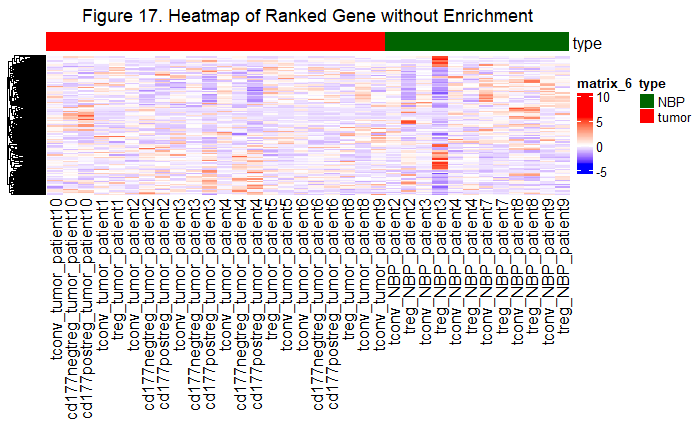

# 1. Introduction

------------------------------------------------------------------------

Compilation of A3 is entirely independent of A1 and A2, so there's no need to compile A1/A2 before compiling A3.

-   Please check [A1 HTML](https://github.com/bcb420-2023/Fangyi_Li/blob/main/A1/a1.html) and [A2 HTML](https://github.com/bcb420-2023/Fangyi_Li/blob/main/A2/A2_FangyiLi.html) for details of previous plots.

## 1.1 Package Setup

------------------------------------------------------------------------

The following are the packages needed for this assignment.

```{r packages, message=FALSE, warning=FALSE}
if (!requireNamespace("BiocManager", quietly = TRUE)) {
  install.packages("BiocManager")
}
library(BiocManager)

if (!requireNamespace("GEOmetadb", quietly = TRUE)) {
  BiocManager::install("GEOmetadb")
}
library(GEOmetadb)

if (!requireNamespace("biomaRt", quietly = TRUE)) {
  BiocManager::install("biomaRt")
}
library(biomaRt)

if (!requireNamespace("edgeR", quietly = TRUE)) {
  install.packages("edgeR")
}
library(edgeR)

if (!requireNamespace("DBI", quietly = TRUE)) {
  install.packages("DBI")
}
library(DBI)

if (!requireNamespace("limma", quietly = TRUE)) {
  install.packages("limma")
}
library(limma)

if(!requireNamespace("knitr", quietly=TRUE)) {
  install.packages("knitr")
}
library(knitr)

if(!requireNamespace("kableExtra", quietly=TRUE)) {
  install.packages("kableExtra")
}
library(kableExtra)

if (!requireNamespace("ComplexHeatmap", quietly = TRUE)) {
  install.packages("ComplexHeatmap")
}
library(ComplexHeatmap)

if (!requireNamespace("circlize", quietly = TRUE)) {
  install.packages("circlize")
}
library(circlize)

if (!requireNamespace("gprofiler2", quietly = TRUE)) {
  install.packages("gprofiler2")
}
library(gprofiler2)

if (!requireNamespace("RCurl", quietly = TRUE)) {
  install.packages("RCurl")
}
library(RCurl)

if (!requireNamespace("GSA", quietly = TRUE)) {
  install.packages("GSA")
}
library(GSA)

if (!requireNamespace("VennDiagram", quietly = TRUE)) {
  install.packages("VennDiagram")
}
library(VennDiagram)
```

## 1.2 Data Set Overview

------------------------------------------------------------------------

Data set **GSE89225** is selected, cleaned, and normalized in A1. Differential gene expression analysis and threshold over-representation analysis are performed in A2. The data set contains RNAseq data from normal breast parenchyma (NBP) and tumor tissues [@plitas2016regulatory]. Following is a concise summary of data manipulation.

### Download and Define

```{r download_define, message=FALSE, warning=FALSE}
# Get expression data
geo_id <- "GSE89225"

# Get expression data from GEOquery
sfiles <- GEOquery::getGEOSuppFiles(geo_id)
fnames <- rownames(sfiles)

# Read CSV and change column names
tcell_exp <- read.csv(fnames[1], header = TRUE, check.names = FALSE)
colnames(tcell_exp)[1] <- "ensembl_gene_id"

# Separate by "_" and define groups
samples <- data.frame(lapply(colnames(tcell_exp)[2:35], 
                             FUN=function(x){unlist(strsplit(x, split = "_"))}))
colnames(samples) <- colnames(tcell_exp)[2:35]
rownames(samples) <- c("Tcell_type","tissue_type", "patients")
samples <- data.frame(t(samples))
```

### Clean and Map

```{r clean_map, message=FALSE, warning=FALSE}
# Check for duplicated genes
summarized_gene_counts <- sort(table(tcell_exp$ensembl_gene_id), decreasing = TRUE)

# Remove invalid Ensenbl gene ids
valid_tcell_exp <- tcell_exp[grep("ENSG", tcell_exp$ensembl_gene_id), ]

# Translate out counts into counts per million
cpms <- edgeR::cpm(valid_tcell_exp[, 2:35])
rownames(cpms) <- valid_tcell_exp[, 1]

# Get rid of low counts
keep <- rowSums(cpms > 1) >= 10
filtered_tcell_exp <- valid_tcell_exp[keep, ]

# Connect to the desired mart
ensembl <- biomaRt::useMart("ensembl")

# Get the set of datasets availble
datasets <- biomaRt::listDatasets(ensembl)

# Limit to the human datasets availble
ensembl <- biomaRt::useDataset("hsapiens_gene_ensembl", mart=ensembl)

# Naming id conversion stash
conversion_stash <- "tcell_id_conversion.rds"

# Save the conversion
if (file.exists(conversion_stash)) {
  tcell_id_conversion <- readRDS(conversion_stash)
} else {
  tcell_id_conversion <- biomaRt::getBM(attributes = c("ensembl_gene_id","hgnc_symbol"), 
                                      filters = c("ensembl_gene_id"), 
                                      values = filtered_tcell_exp$ensembl_gene_id,
                                      mart = ensembl)
  saveRDS(tcell_id_conversion, conversion_stash)
}

# Annotated version (merge)
annot_tcell_exp <- merge(tcell_id_conversion, filtered_tcell_exp, all.y = TRUE)
```

### Normalization (TMM)

Trimmed Mean of M-values (TMM) normalization is used, which is a method that calculates scaling factors for each sample to account for differences in the total number of reads across samples and to adjust for other technical biases [@lec4].

-   For more details, please check [A1 HTML](https://github.com/bcb420-2023/Fangyi_Li/blob/main/A1/a1.html).

```{r normalization, message=FALSE, warning=FALSE}
# Reassignment
original_tcell_exp <- annot_tcell_exp

# Create an edgeR container for RNASeq count data
original_data_matrix <- as.matrix(original_tcell_exp[, 3:36])
rownames(original_data_matrix) <- original_tcell_exp$ensembl_gene_id

# Calculate the normalization factors
d <- edgeR::DGEList(counts = original_data_matrix, group = samples$tissue_type)
d <- edgeR::calcNormFactors(d)

# Normalize data set
normalized_tcell_exp <- edgeR::cpm(d)
normalized_tcell_exp <- cbind(original_tcell_exp[, 1:2], normalized_tcell_exp)
rownames(normalized_tcell_exp) <- NULL

# Remove duplicate HGNC symbols to avoid false assignment in the future
normalized_tcell_exp <- dplyr::distinct(normalized_tcell_exp, hgnc_symbol, .keep_all = TRUE)
```

### Differential Gene Expression Analysis

The Quasi Likelihood (QL) model implemented in the `edgeR` package is used for differential expression analysis. The model uses an empirical Bayes shrinkage approach to estimate the gene-specific dispersions and identify differentially expressed genes [@edgeR2016].

-   For more details, please check [A2 HTML](https://github.com/bcb420-2023/Fangyi_Li/blob/main/A2/A2_FangyiLi.html).

```{r qlf, message=FALSE, warning=FALSE}
# Create data matrix
expressionMatrix <- as.matrix(normalized_tcell_exp[, 3:36])
rownames(expressionMatrix) <- normalized_tcell_exp$ensembl_gene_id
colnames(expressionMatrix) <- colnames(normalized_tcell_exp)[3:36]

# Create design matrix
edgeR_model_design <- model.matrix(~ samples$tissue_type)

# Set edgeR object
edgeR_d <- edgeR::DGEList(counts = expressionMatrix, 
                    group=samples$tissue_type)

# Estimate dispersion
edgeR_d <- edgeR::estimateDisp(edgeR_d, edgeR_model_design)

# Fit the Quasi liklihood model
edgeR_fit <- edgeR::glmQLFit(edgeR_d, edgeR_model_design)
edgeR_qlf <- edgeR::glmQLFTest(edgeR_fit, coef = 'samples$tissue_typetumor')

# Sort by p-values
qlf_output_hits <- edgeR::topTags(edgeR_qlf,
                                  sort.by = "PValue",
                                  n = nrow(normalized_tcell_exp))

# Clustering samples by sample type
tumor <- normalized_tcell_exp[, grepl("tumor", colnames(normalized_tcell_exp))]
NBP <- normalized_tcell_exp[, grepl("NBP", colnames(normalized_tcell_exp))]
exp_avg <- data.frame(hgnc_symbol = gsub("-", ".", normalized_tcell_exp[, 2]), 
                      Tumor = rowMeans(tumor), 
                      NBP = rowMeans(NBP))

# Construct the edgeR result table
qlf_result <- cbind(qlf_output_hits$table, ensembl_gene_id = rownames(qlf_output_hits$table))
qlf_result <- merge(tcell_id_conversion, qlf_result, by = "ensembl_gene_id", all.x = TRUE)
```

### Thresholded Over-representation Analysis

Gene set is separated into up-regulated and down-regulated subsets. `g:Profiler` and its package `gprofiler2` are used to perform thresholded over-representation analysis (ORA) [@R-gprofiler2]. The top 40 significant results are shown below as tables. Note that `gprofiler2::gost` may not proceed due to frequent access and website shutting down, wait and re-compilation might be necessary.

-   For more details, please check [A2 HTML](https://github.com/bcb420-2023/Fangyi_Li/blob/main/A2/A2_FangyiLi.html).

```{r threshold_list, message=FALSE, warning=FALSE}
# Add rank column and order
qlf_result[, "rank"] <- -log(qlf_result$PValue, base = 10) * sign(qlf_result$logFC)
qlf_result <- qlf_result[order(qlf_result$rank), ]

# Divide into 2 gene lists
upregulated_genes <- qlf_result$hgnc_symbol[which(qlf_result$PValue < 0.05 & qlf_result$logFC > 0)]
downregulated_genes <- qlf_result$hgnc_symbol[which(qlf_result$PValue < 0.05 & qlf_result$logFC < 0)]

# ORA (up-regulated genes)
gost_up <- gprofiler2::gost(query = upregulated_genes,
                            organism = "hsapiens", 
                            sources = c("GO:BP", "KEGG", "REAC", "WP"),
                            significant = FALSE,
                            user_threshold = 0.05,
                            correction_method = "fdr",
                            exclude_iea = TRUE)

# Sort ORA results (up-regulated genes)
gost_up_result <- gost_up$result[order(gost_up$result$p_value, decreasing = FALSE),]
sig_up <- gost_up_result[which(gost_up_result$source == "GO:BP"), ][1:10, ]
sig_up <- rbind(sig_up, gost_up_result[which(gost_up_result$source == "KEGG"), ][1:10, ])
sig_up <- rbind(sig_up, gost_up_result[which(gost_up_result$source == "REAC"), ][1:10, ])
sig_up <- rbind(sig_up, gost_up_result[which(gost_up_result$source == "WP"), ][1:10, ])
sig_up <- subset(sig_up, select = c(9:11))

# Output up-regulated g:Profiler report (top 40)
sig_up %>%
  kableExtra::kbl(caption = "Table 1. Up-regulated g:Profiler Report", ) %>%
  kableExtra::kable_classic(full_width = F, html_font = "Cambria")

# ORA (down-regulated genes)
gost_down <- gprofiler2::gost(query = downregulated_genes,
                            organism = "hsapiens", 
                            sources = c("GO:BP", "KEGG", "REAC", "WP"),
                            significant = FALSE,
                            user_threshold = 0.05,
                            correction_method = "fdr",
                            exclude_iea = TRUE)

# Sort ORA results (down-regulated genes)
gost_down_result <- gost_down$result[order(gost_down$result$p_value, decreasing = FALSE),]
sig_down <- gost_down_result[which(gost_down_result$source == "GO:BP"), ][1:10, ]
sig_down <- rbind(sig_down, gost_down_result[which(gost_down_result$source == "KEGG"), ][1:10, ])
sig_down <- rbind(sig_down, gost_down_result[which(gost_down_result$source == "REAC"), ][1:10, ])
sig_down <- rbind(sig_down, gost_down_result[which(gost_down_result$source == "WP"), ][1:10, ])
sig_down <- subset(sig_down, select = c(9:11))

# Output down-regulated g:Profiler report (top 40)
sig_down %>%
  kableExtra::kbl(caption = "Table 2. Down-regulated g:Profiler Report", ) %>%
  kableExtra::kable_classic(full_width = F, html_font = "Cambria")
```

# 2. Non-thresholded Gene Set Enrichment Analysis (GSEA)

------------------------------------------------------------------------

Non-thresholded gene set enrichment analysis (GSEA) is a statistical method used to identify biologically meaningful gene sets that are differentially expressed between two biological conditions or groups. Therefore, GSEA is necessary for our gene set [@subramanian2005gene].

## 2.1 GSEA Preparation

------------------------------------------------------------------------

First, we must prepare prepare files needed for GSEA, ranked geneset and `.gmt` file from Bader Lab.

```{r gsea_prep, message=FALSE, warning=FALSE}
# Save gene set by the order of ranks as .rnk file
if (!file.exists("./A3_data/geneset_ranks.rnk")) {
    geneset_ranks <- data.frame(GeneName = qlf_result$hgnc_symbol, 
                                rank = -log(qlf_result$PValue, base = 10) * sign(qlf_result$logFC))
    
    geneset_ranks <- geneset_ranks[order(geneset_ranks$rank), ]
    
    write.table(x = geneset_ranks, 
                file = file.path("A3_data", "geneset_ranks.rnk"), 
                col.names = F, 
                row.names = F, 
                quote = F, 
                sep = "\t")
}

# Assign gmt url
gmt_url = "http://download.baderlab.org/EM_Genesets/current_release/Human/symbol/"

# List all the files on the server
filenames = RCurl::getURL(gmt_url)
tc = textConnection(filenames)
contents = readLines(tc)
close(tc)

# Get the gmt that has all the pathways and does not include terms inferred from electronic annotations(IEA) start with gmt file that has pathways only
rx = gregexpr("(?<=<a href=\")(.*.GOBP_AllPathways_no_GO_iea.*.)(.gmt)(?=\">)", 
              contents, perl = TRUE)

gmt_file = unlist(regmatches(contents, rx))

dest_gmt_file <- file.path("./A3_data", gmt_file)

download.file(paste(gmt_url, gmt_file, sep = ""), destfile = dest_gmt_file)
```

Files `geneset_ranks.rnk` and `Human_GOBP_AllPathways_no_GO_iea_April_02_2023_symbol.gmt` should be successfully saved under the current directory and ready for running GSEA. Note that the version of the `.gmt` file might change according to updates.

## 2.2 Run GSEA

------------------------------------------------------------------------

### Steps to run GSEA locally

1.  [Download](https://www.gsea-msigdb.org/gsea/index.jsp) and open GSEA software.

2.  Select *Load data* option.

3.  Load `geneset_ranks.rnk` and `Human_GOBP_AllPathways_no_GO_iea_April_02_2023_symbol.gmt` into GSEA.


4.  Select *Run GSEAPreranked* option from *Tools*.

5.  Fix the parameters as follows:

-   Gene sets database: `Human_GOBP_AllPathways_no_GO_iea_April_02_2023_symbol.gmt`
-   Number of permutations: `1000`
-   Ranked List: `geneset_ranks`
-   Collapse/Remap to gene symbols: `No_Collapse`
-   Max size: exclude large sets: `200`
-   Min size: exclude small sets: `15`


6.  Run the analysis.

The analysis status is shown on the bottom left window, and the GSEA report is saved in the default local folder. Since this process is done locally, the TSV version of the GSEA report is uploaded to the `A3_data` folder.

```{r gsea_report, message=FALSE, warning=FALSE}
# Read GSEA reports for up-regulated genes
up_report <- read.table(file = "./A3_data/gsea_report_for_na_pos.tsv", 
                        sep = '\t', 
                        header = TRUE, 
                        fill = TRUE)

# Output up-regulated gene report top 10
up_report[1:10, c(1, 4:11)] %>%
  kableExtra::kbl(caption = "Table 5. Up-regulated GSEA Report") %>%
  kableExtra::kable_classic(full_width = F, html_font = "Cambria")

# Read GSEA reports for down-regulated genes 
down_report <- read.table(file = "./A3_data/gsea_report_for_na_neg.tsv", 
                          sep = '\t', 
                          header = TRUE, 
                          fill = TRUE)

# Output down-regulated gene report top 10
down_report[1:10, c(1, 4:11)] %>%
  kableExtra::kbl(caption = "Table 6. Down-regulated GSEA Report") %>%
  kableExtra::kable_classic(full_width = F, html_font = "Cambria")
```

The top 10 results from up-regulated and down-regulated gene reports are shown above in tables.

## 2.3 GSEA Questions

------------------------------------------------------------------------

### Q1. What method did you use? What genesets did you use? Make sure to specify versions and cite your methods.

For the analysis, I used the GSEA pre-ranked algorithm (version 4.3.2) and the human Gene Ontology Biological Processes (GOBP) gene set from the Bader lab [@subramanian2005gene]. The specific GOBP file I used included all pathways and excluded terms inferred from electronic annotations (IEA) (version April 2nd, 2023). The parameters for the GSEA analysis are described in section [2.2 Run GSEA] of the report, and the sample GSEA reports for up-regulated and down-regulated genes can be found in *Tables 5. Up-regulated GSEA Report* and *Tables 6. Down-regulated GSEA Report*.

### Q2. Summarize your enrichment results.

Sample GSEA reports for up-regulated and down-regulated genes can be found in *Tables 5. Up-regulated GSEA Report* and *Tables 6. Down-regulated GSEA Report*.

**Summary for up-regulated genes:**

-   3133 / 5561 gene sets are up-regulated in tumor phenotype
-   1289 gene sets are significant at FDR \< 25%
-   660 gene sets are significantly enriched at nominal pvalue \< 1%
-   1028 gene sets are significantly enriched at nominal pvalue \< 5%

**Summary for down-regulated genes:**

-   2428 / 5561 gene sets are down-regulated in tumor phenotype
-   204 gene sets are significantly enriched at FDR \< 25%
-   150 gene sets are significantly enriched at nominal pvalue \< 1%
-   342 gene sets are significantly enriched at nominal pvalue \< 5%

### Q3. How do these results compare to the results from the thresholded analysis in Assignment #2. Compare qualitatively. Is this a straight forward comparison? Why or why not?

Up-regulated gene set analysis: The GSEA and thresholded analyses both identified a large number of significant up-regulated gene sets, but the specific pathways identified differences between the two methods. The GSEA analysis was dominated by the interferon-related pathway, while the thresholded analysis identified mostly immune response and cytokine signaling pathways. These differences suggest that the two approaches may capture different aspects of the biological response, and combining the results from both analyses may provide a more comprehensive picture of the up-regulated pathways.

Down-regulated gene set analysis: In contrast to the up-regulated gene sets, both GSEA and the thresholded analyses identified relatively few significant down-regulated gene sets. However, the specific pathways identified by each analysis differ. The GSEA analysis identified protein synthesis as significant for down-regulated genes, while the thresholded analysis identified mostly cytoplasmic-related pathways. These differences suggest that the two approaches may capture different aspects of the biological response, and combining the results from both analyses may provide a more comprehensive picture of the down-regulated pathways.

This is a straightforward comparison. While both GSEA and `g:Profiler` used the Benjamini-Hochberg FDR method and should produce comparable results, there were differences between the gene sets identified by each analysis [@subramanian2005gene]. Notably, the GSEA analysis produced heavily clustered output compared to the `g:Profiler` results. Nevertheless, the similarities and differences between the results from both analyses provide complementary information about the biological response, and combining the results may provide a more comprehensive understanding of the pathways involved.

# 3. Visualize Gene Set Enrichment Analysis in Cytoscape

------------------------------------------------------------------------

## 3.1 Cytoscape preparation

------------------------------------------------------------------------

Cytoscape (version 3.9.1) is used to visualize GSEA, and it requires a descending, na-omitted ranked gene set [@shannon2003cytoscape]. Therefore, we need to output another specific rank file for Cytoscape.

```{r, message=FALSE, warning=FALSE}
# Obtain specific rank file for Cytoscape
if (!file.exists("./A3_data/cytoscape_ranks.rnk")) {
    cytoscape_ranks <- data.frame(GeneName = qlf_result$hgnc_symbol,
                                  rank = -log(qlf_result$PValue, base = 10) * sign(qlf_result$logFC))
    
    # Order from the greatest to smallest
    cytoscape_ranks <- cytoscape_ranks[order(-cytoscape_ranks$rank), ]
    
    # Remove NA rows
    cytoscape_ranks <- na.omit(cytoscape_ranks)
    
    # Output .rnk file
    write.table(x = cytoscape_ranks, 
                file = file.path("./A3_data", "cytoscape_ranks.rnk"), 
                col.names = F, 
                row.names = F, 
                quote = F, 
                sep = "\t")
}
```

## 3.2 Run Cytoscape

------------------------------------------------------------------------

### Steps to run Cytoscape locally

1.  [Download](https://cytoscape.org/) and open Cytoscape software.

2.  Choose *Apps* -\> *EnrichmentMap*.

3.  Under the Create Enrichment Map window, fix the parameters as follows (others stay default):

-   Analysis Type: `GSEA`
-   Enrichment Pos: `gsea_report_for_na_pos.tsv`
-   Enrichment Neg: `gsea_report_for_na_neg.tsv`
-   GMT: `Human_GOBP_AllPathways_no_GO_iea_April_02_2023_symbol.gmt`
-   Ranks: `cytoscape_ranks.rnk`
-   FDR q-value cutoff: `0.05`
-   p-value cutoff: `1.0`


4.  Build the enrichment Map.

## 3.3 Enrichment Map Analysis and Questions

------------------------------------------------------------------------

### Q1. Create an enrichment map - how many nodes and how many edges in the resulting map? What thresholds were used to create this map? Make sure to record all thresholds. Include a screenshot of your network prior to manual layout.


The EnrichmentMap app (version 3.3.5) is used for building the enrichment map [@merico2010enrichment]. There are 617 nodes and 6630 edges in the resulting map. Thresholds I used:

-   FDR q-value cutoff (node): `0.05`
-   P-value cutoff (node): `1.0`
-   Edge cutoff (similarity): `0.375`

### Q2. Annotate your network - what parameters did you use to annotate the network. If you are using the default parameters make sure to list them as well.

The AutoAnnotate app (version 1.4.0) annotates the original enrichment map [@kucera2016autoannotate]. Parameters used:

-   Cluster algorithm: `MCL Cluster`
-   Edge weight column: `similarity_coefficient`
-   Label column: `GS_DESCR`
-   Label algorithm: `WordCloud: Adjacent Words`
-   Max words per label: `3`
-   Minimum word occurrence: `1`
-   Adjacent word bonus: `8`


The result shows that the largest up-regulated cluster is "gli3 proteasome degradation" with 96 nodes, and the largest down-regulated cluster is "selenocysteine synthesis valine" with 40 nodes.


### Q3. Make a publication ready figure - include this figure with proper legends in your notebook.


### Q4. Collapse your network to a theme network. What are the major themes present in this analysis? Do they fit with the model? Are there any novel pathways or themes?


The major themes are "gli3 proteasome degradation", "selenocysteine synthesis valine," "regulatory immune immunity," "packaging telomere secretory," "differentiation alpha beta," etc. Some themes fit the model, and some do not."Regulatory immune immunity" seems to be the novel theme since regulatory T cells (Tregs) play a critical role in maintaining immune homeostasis and preventing autoimmune diseases. The other pathways listed, including "gli3 proteasome degradation", "selenocysteine synthesis valine," "packaging telomere secretory," and "differentiation alpha beta," do not appear to be directly related to T cells or the immune system.

# 4. Interpretation and Detailed View of Results

------------------------------------------------------------------------

## 4.1 Discussion and Questions

------------------------------------------------------------------------

### Q1. Do the enrichment results support conclusions or mechanism discussed in the original paper? How do these results differ from the results you got from Assignment #2 thresholded methods

The original paper reports the upregulation of cytokine and chemokine receptor genes in tumor-resident Treg cells compared to normal tissue resident ones [@plitas2016regulatory]. In our up-regulated GSEA analysis, 25 cytokine-related pathways were identified but ranked below the top 100 pathways. However, in the cluster network analysis, the "cytokine stimulus mediated" pathway was up-regulated and ranked 18 in all clusters. Notably, cytokine-related pathways were more significantly enriched in the previous thresholded over-representation analysis conducted by `g:Profiler`. Overall, while the enrichment results partially support the conclusions and mechanisms discussed in the original paper, the differences between the GSEA and thresholded analysis suggest further investigation.

### Q2. Can you find evidence, i.e. publications, to support some of the results that you see. How does this evidence support your result?

The paper, The Role of Cytokines in Breast Cancer Development and Progression, states that "cytokines involved in angiogenesis. The inflammatory infiltrate that is usually found in breast tumors produces IL-6, IL-1α, and IL-1β, which upregulate COX-2, which, in turn, increases VEGF expression in tumor cells promoting angiogenesis." IL-1α (IL1A) can be found under the upregulated gene list. The paper "suggests that cytokines play an important role in the regulation of both induction and protection in breast cancer [@esquivel2015role]."

The upregulated GSEA analysis suggests a significant association between Type I interferon (IFN-α/β) and Tregs. This finding is supported by a previous study that reports the direct influence of IFN-α/β on the fate of CD4+ and CD8+ T cells during the early stages of antigen recognition, as well as its role as a counter-regulator of T helper type 2 and type 17 responses [@kumar2018human]. The enrichment results also indicate that interferon-related pathways rank among the top, further supporting the potential involvement of IFN-α/β in Treg function.

## 4.2 Dark Matter Analysis

------------------------------------------------------------------------

**Task**: Sometimes the most interesting information is the gene that has no information. In this type of pathway analysis we can only discover what we have already described previously in the literature or pathway databases. Often pathways found in one disease are applicable to other diseases so this technique can be very helpful. It is important to highlight any genes that are significantly differentially expressed in your model but are not annotated to any pathways. We refer to this set of genes as the dark matter.

```{r dark_matter, message=FALSE, warning=FALSE}
# Get the geneset file
capture.output(genesets <- GSA::GSA.read.gmt(dest_gmt_file), file = "gsa_loud.out")
names(genesets$genesets) <- genesets$geneset.names
genes_all_gs <- unique(unlist(genesets$genesets)) 

# Get the expression data
expression <- normalized_tcell_exp

# Get genes from the set of enriched pathway (no matter what threshold) 
all_enr_genesets <- c(up_report$NAME, down_report$NAME) 
genes_enr_gs <- c()
for(i in 1:length(all_enr_genesets)){
  current_geneset <- unlist(genesets$genesets[which(genesets$geneset.names %in% all_enr_genesets[i])])
  genes_enr_gs <- union(genes_enr_gs, current_geneset)
}

# Get genes in the significant enrichment results
FDR_threshold <- 0.001
all_enr_genesets_sig <- c(down_report[which(down_report$FDR.q.val < FDR_threshold),]$NAME, 
                          up_report[which(up_report$FDR.q.val < FDR_threshold),]$NAME) 
genes_enr_gs_sig <- c()
for(i in 1:length(all_enr_genesets_sig)){
  current_geneset <- unlist(genesets$genesets[which(genesets$geneset.names %in% all_enr_genesets_sig[i])])
  genes_enr_gs_sig <- union(genes_enr_gs_sig, current_geneset)
}
```

### Venn Diagram of Dark Matter Overlaps

```{r venn_diagram, message=FALSE, warning=FALSE}
# Constructe venn diagram
A <- na.omit(genes_all_gs)
B <- na.omit(genes_enr_gs_sig)
C <- expression[, 2]

# Draw venn diagram
png(file.path(getwd(), "A3_figures", "dark_matter_overlaps.png"))
VennDiagram::draw.triple.venn(area1 = length(A), area2 = length(B), area3 = length(C), 
                                n12 = length(intersect(A, B)), n13 = length(intersect(A, C)), 
                                n23 = length(intersect(B, C)), n123 = length(intersect(A, intersect(B, C))), 
                                category = c("all genesets", "all enrichment results", "all expressed data"), 
                                fill = c("red", "green", "blue"), 
                                cat.col = c("red", "green", "blue"))
```


Summary of dark matter analysis:

* There are 15746 unique genes in the expression file.
* There are 2305 unique genes in the enrichment results.
* There are 18526 unique genes in the geneset file.
* There are 3705 genes absent from the GMT file.
* There are 13899 genes absent from the enrichment analysis.


```{r, message=FALSE, warning=FALSE}
# Get rank file
ranks <- read.table(file.path("A3_data", "geneset_ranks.rnk"), sep = "\t", stringsAsFactors = F)
ranks <- na.omit(ranks)
colnames(ranks) <- c("gene", "rank")

# Get set of genes that have no annotation
genes_no_annotation <- setdiff(C, A)

# Get top ranked genes that have no annotation
ranked_gene_no_annotation <- ranks[which(ranks[,1] %in% genes_no_annotation),]
ranked_gene_no_annotation <- ranked_gene_no_annotation[order(ranked_gene_no_annotation$rank, decreasing = T), ]

ranked_gene_no_annotation [1:10, ] %>%
  kableExtra::kbl(caption = "Table 14. Ranked Gene without Annotation") %>%
  kableExtra::kable_classic(full_width = F, html_font = "Cambria")

# Get set of genes that have no enrichment
genes_no_enrichment <- setdiff(C, B)

# Get top ranked genes that have no enrichment
ranked_gene_no_enrichment <- ranks[which(ranks[,1] %in% genes_no_enrichment),]
ranked_gene_no_enrichment <- ranked_gene_no_enrichment[order(ranked_gene_no_enrichment$rank, decreasing = T), ]

ranked_gene_no_enrichment[1:10, ] %>%
  kableExtra::kbl(caption = "Table 15. Ranked Gene without Enrichment") %>%
  kableExtra::kable_classic(full_width = F, html_font = "Cambria")
```

### Heatmaps

The function `createHeatmap` is defined for generating heatmaps repeatably. 

```{r heatmaps, message=FALSE, warning=FALSE}
# Define a heatmap-creating function
createHeatmap <- function(geneset, my_caption) {
  heatmap_matrix <- normalized_tcell_exp[, 3:ncol(normalized_tcell_exp)]
  rownames(heatmap_matrix) <- normalized_tcell_exp$ensembl_gene_id
  colnames(heatmap_matrix) <- colnames(normalized_tcell_exp[, 3:ncol(normalized_tcell_exp)])

  # Scale
  heatmap_matrix <- t(scale(t(heatmap_matrix)))
  rownames(heatmap_matrix) <- normalized_tcell_exp$hgnc_symbol

  # Create top hit version of heatmap matrix
  heatmap_matrix_tophits <- heatmap_matrix[which(rownames(heatmap_matrix) %in% geneset),]
  heatmap_matrix_tophits <- heatmap_matrix_tophits[, c(grep("tumor", colnames(heatmap_matrix_tophits)),
                            grep("NBP", colnames(heatmap_matrix_tophits)))]

  # Decide the colour by range
  heatmap_col = circlize::colorRamp2(c(min(heatmap_matrix_tophits), 
                                     0,
                                     max(heatmap_matrix_tophits)),
                                     c("blue", "white", "red"))

  # Set colours
  ha_colours <- c("red", "darkgreen")
  names(ha_colours) <- c("tumor", "NBP")

  # Set annotations
  ha <- ComplexHeatmap::HeatmapAnnotation(df = data.frame(type = rep(c("tumor", "NBP"), c(22, 12))),
                                          col = list(type = ha_colours))

  # Plot annotated heatmap
  heatmap_result <- ComplexHeatmap::Heatmap(as.matrix(heatmap_matrix_tophits),
                           cluster_rows = TRUE,
                           cluster_columns = FALSE,
                           show_row_dend = TRUE,
                           show_column_dend = FALSE,
                           col = heatmap_col,
                           show_column_names = TRUE,
                           show_row_names = FALSE,
                           show_heatmap_legend = TRUE,
                           top_annotation = ha,
                           column_title = my_caption)

    return(heatmap_result)
}


hm_no_annotation <- createHeatmap(ranked_gene_no_annotation$gene, "Figure 16. Heatmap of Ranked Gene without Annotation")
hm_no_enrichment <- createHeatmap(ranked_gene_no_enrichment$gene, "Figure 17. Heatmap of Ranked Gene without Enrichment")

# Heatmaps below are pre-generated since it takes too long to run and load the images.
```




Both heatmaps above do not show any distinct clustering of genes among the NBP and tumor samples. Hence, it is reasonable to conclude that the dark matter component of the data is random and has a limited impact on the enrichment analysis.

# References

------------------------------------------------------------------------
